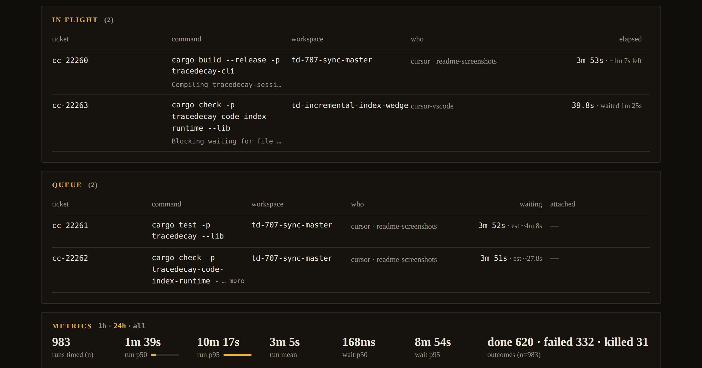
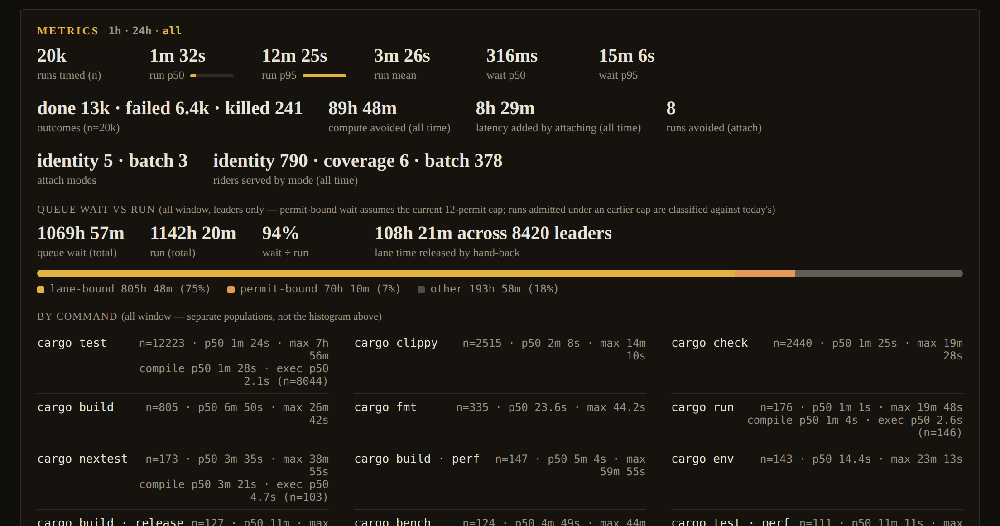
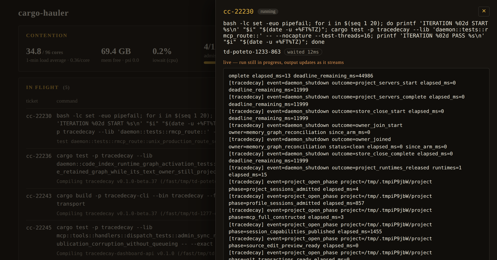
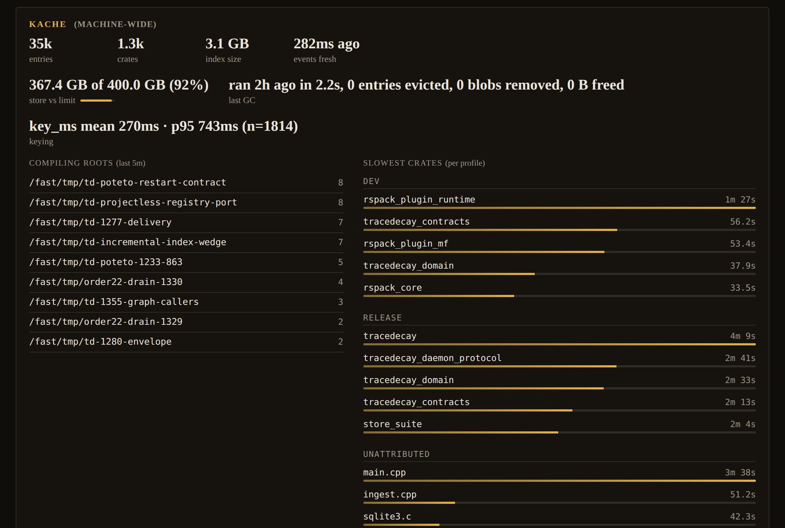

<p align="center"></p>

# cargo-hauler

**One Cargo, many agents.** cargo-hauler is a broker for `cargo` on a machine
where several AI coding sessions (Claude Code, Codex, Cursor), scripts, and
terminals build the same Rust workspaces at once. It stops them from fighting
over the build directory, runs the work once, and hands every requester its
own result.

## The problem

Agents run `cargo check`, `cargo test`, and `cargo build` constantly and
independently. On a shared machine that means the same crates compiling five
times over, everyone blocking on `Blocking waiting for file lock on build
directory`, a saturated CPU, and shell tools that kill a build at their ten
minute timeout with nothing to show for it. Nobody can see what is running,
what is queued, or why their command is slow.

## What it does

- **Intercepts** every Cargo invocation: hooks rewrite `cargo …` in agent
  shells, an optional PATH shim covers scripts and terminals, and MCP tools
  let agents submit work directly.
- **Coalesces** compatible requests: a byte-identical command attaches to the
  run already in flight, a narrower `check` rides a broader `build`, and
  queued tests with the same selection fold into one `--no-fail-fast` run.
  Riders receive the leader's streamed output and exit code as if they had
  run it themselves.
- **Schedules and admits** work per workspace lane under a machine-wide
  permit cap, with load, memory-pressure, and heavy-profile gates, cost
  estimates from run history and [kache](https://github.com/ScriptedAlchemy/kache)
  priors, and `--after cc-N` dependencies when a test needs a build first.
- **Keeps a ticket** (`cc-N`) for every request: status, exit code, live
  output tail, the whole output log on disk, timings, and attribution to the
  session that asked. Long builds become background tickets that agents
  `await`, and a stop hook holds an agent's turn until its build lands.
- **Protects the machine**: `cargo clean` is refused while builds are in
  flight, stalled processes are flagged (and killed when their owner is
  gone), and `hauler kill` frees a wedged lane through the broker instead of
  by PID.
- **Shows everything** in a live dashboard: contention, in-flight and queued
  work, lanes, per-command timings, compute avoided, and kache data.



## Quick start

Install from npm — the package carries a ready-made plugin for each host and
its own installer, so nothing else is needed:

```sh
npm install -g cargo-hauler

cargo-hauler-install install claude --scope user   # Claude Code
cargo-hauler-install install codex                 # Codex
cargo-hauler-install install cursor --mode local   # Cursor
hauler install-shim                                # optional: cargo from scripts and terminals too
```

Restart the host (or reload the window) so new sessions load the hooks. The
daemon starts on demand with the first brokered request; `hauler status` shows
what is running, and the `hauler_status` tool opens the dashboard in hosts that
render MCP Apps. Prefer the hosts' own plugin commands, or building from a
checkout? See [Install](#install).

The CLI is `hauler` on PATH from `npm i -g cargo-hauler`. Never run
`scripts/hauler.mjs` or any path under `.claude/plugins/cache`,
`.codex/plugins/cache`, `.cursor/plugins`, or `artifact/` directly.

## Commands and tools

`hauler` is the command line; agents reach the same operations as MCP tools
(`hauler_status`, `hauler_await`, …) and hooks rewrite plain `cargo …` into
`hauler exec` automatically. Every command except `exec`, `daemon`, and
`install-shim` also accepts `--json` for the machine-readable value.

| Command | Behavior |
| --- | --- |
| `hauler exec [--session ID] [--host HOST] [--cwd DIR] [--bg] [--after TICKET[,TICKET…]] -- <cargo …>` | Submit Cargo through the daemon and stream output; hooks rewrite commands to this form. A relative `--cwd` is resolved against the caller's directory. `--after` (repeatable or comma-separated) keeps the request queued until every named ticket has finished; it fails with `prerequisite cc-N <status>` if one of them fails or is killed, and an unknown ticket is rejected as a bad intent. Exits with cargo's code; `130`/`143` after a SIGINT/SIGTERM (the ticket is killed first); `75` when auto-backgrounded. |
| `hauler status [--limit N] [--cwd DIR] [--session ID] [--lane KEY] [--ticket ID …] [--status S …] [--command-contains TEXT]` | Queue, active runs, lanes, admission, kache, optionally filtered. Rows are bounded summaries: no row carries an output tail; a running row carries `outputPreview`, the last 8 lines (at most 512 bytes) of its live output, cut at a line boundary, and every other row has `outputPreview: null`. Read a ticket's whole tail with `hauler result`. |
| `hauler log [--limit N]` | Recent requests from the ledger, as the same bounded summary rows. |
| `hauler last` | The most recent request, as a detail record (from the daemon while it is running, otherwise from the ledger) — its output tail included. |
| `hauler await <ticket> [--max-wait-ms N]` | Long-poll until the ticket finishes or the wait expires (default 30 s, ceiling 2 h per call — the daemon's await ceiling; call again to keep waiting). A host with its own per-call deadline still bounds one call: Codex stops a tool call at `tool_timeout_sec` (60 s unless raised). |
| `hauler result <ticket> [--full]` | A stored ticket in full: the settled 16 KiB output tail, or the whole live in-memory tail while it runs (not the status preview). The document names the full on-disk output log (`Full output: <path> (size)`) and `--json` carries it as `request.outputPath`; `--full` prints that whole log instead of the tail (the last ~768 KiB when it does not fit, with the path for the rest). |
| `hauler kill <ticket>` | Stop a ticket: drop it from the queue or SIGTERM (then SIGKILL) its cargo process group, freeing the lane. Riders return to their lane or fail with it. |
| `hauler request [--session ID] [--host HOST] [--cwd DIR] [--after TICKET …] -- <cargo …>` | Submit a background request and return its ticket, with where it landed in its lane (`queued behind cc-3281 (~13m)`, `waiting for cc-3281`, or `attached to cc-3281`). `--after` works as for `exec`. |
| `hauler daemon <run\|start\|stop\|status\|restart>` | Manage the daemon lifecycle. `restart` is the manual replacement: it sends the graceful stop, waits up to 5 s for the old pid to exit, then starts a daemon from this install and prints both (`restarted: pid 741314 (0.6.0) → pid 742001 (0.6.1)`); a daemon that has not exited by then is reported, not killed, and nothing is started (exit `1`). Tickets in flight are not handed over: the old daemon settles them itself as it shuts down — `killed`, error `daemon shutdown` — and callers resubmit (only rows a daemon that died without shutting down never marked are stamped `orphaned by daemon restart` by the next daemon's first ledger pass). After upgrading the package, every client entry — reads (`status`, `daemon status`, `log`, `last`, `await`, `result`, the dashboard and MCP tools), writes, and hooks — checks the daemon version before requesting a versioned payload and replaces a daemon from the previous install automatically. When the old daemon has not exited within the grace, the command fails with `` cargo-hauler daemon pid N (X.Y.Z) is still running 5s after the shutdown request; not restarted — retry once it has exited, or stop it with `hauler daemon stop` `` instead of parsing its payload or starting a second daemon. |
| `hauler install-shim [--dir DIR] [--real-cargo PATH] [--force]` | Install the optional PATH shim. |
| `hauler dashboard [--target claude\|codex\|cursor\|portable] [--port N] [--no-open]` | Open the dashboard in a plain browser tab: serve the MCP App standalone against the plugin's own `hauler` server on `127.0.0.1` (`spawnServeApp` from `agent-bundle/serve-app-command`, which runs `agent-bundle serve-app` as a child process and prints its URL), call `hauler_status` once so it opens populated, and stay in the foreground until Ctrl-C. A checkout command: it needs the built `artifact/` beside the CLI and `agent-bundle` under `node_modules` (`pnpm install && pnpm build`); the npm package ships no runtime dependencies and an installed host pack has no artifact, so both report what is missing. In an MCP host, call `hauler_status` instead. |

The `hauler` MCP server projects the same operations as `hauler_status`,
`hauler_log`, `hauler_last`, `hauler_await`, `hauler_result`, `hauler_kill`,
and `hauler_request`, with the same filters as the CLI. `hauler_status` and
`hauler_log` rows are the same bounded summaries (`outputPreview`, never a
tail); `hauler_result`, `hauler_await`, and `hauler_last` carry the whole
tail.

## Dashboard

The dashboard is an MCP App (`ui://cargo-hauler/dashboard.html`) attached to
`hauler_status`. It shows contention and admission, in-flight and queued work
— each running row with the last line of its output preview, each ticket's
drawer with the whole tail fetched through `hauler_result` — metrics over
one-hour, 24-hour, and all-time windows, per-command timings, optional kache
data, lanes, and history. It polls `hauler_status` every 5 s while open.
Outside an MCP host, the installed plugin's own `web` command serves the same
App in a plain browser tab against the running daemon:

```sh
node <plugin root>/bin/cargo-hauler.mjs web
```

where the plugin root is the directory `cargo-hauler-install install <host>`
printed (the one holding `agent-bundle.manifest.json`), or `artifact/` in a
checkout after `pnpm run build`.



## How the broker works

Requests enter through the `hauler` CLI, `tool/before` hooks that rewrite
shell commands, an optional PATH shim, or the `hauler_request` MCP tool. The
daemon normalizes the Cargo command into an intent, records a ticket in the
SQLite ledger, and assigns the request to a lane.

The hook parses the shell command and rewrites each Cargo invocation to
`hauler exec --session … --host … -- cargo …`. It recognizes `cargo` behind an
absolute path (`~/.cargo/bin/cargo`), and behind the wrappers agents actually
use: `env -u VAR X=y cargo …`, `timeout 600 cargo …`,
`rustup run <toolchain> [--] cargo …`, `stdbuf`, `nice`, `ionice`, `nohup`,
`/usr/bin/time`, `strace`, `sudo`, `xargs`, `command`, `exec`, `builtin`,
and a negated test (`while ! cargo build; do …`). Other `rustup`
subcommands, lookups (`command -v cargo`, `type cargo`, `which cargo`), and
already-wrapped invocations are left alone; in a partially wrapped list
(`hauler exec -- cargo build && cargo test`) only the unwrapped half is
rewritten. The rewrite never passes `--cwd`: the command runs in the same
shell, so `hauler exec` inherits the working directory and
`cd crates/foo && cargo build` builds in `crates/foo`.

Before rewriting, the hook checks that the parser can reproduce the original
command token for token. Constructs the pinned parser cannot round-trip —
a background `&` (`nohup cargo build … &`, `cargo build & pid=$!`), the
`time` keyword, `|&`, `coproc`, a heredoc that feeds a pipeline or is
followed by another statement, `elif`, and `function name { … }` — are left
untouched and run as plain Cargo rather than risk emitting a changed
command.

Both shell hooks run on every shell tool call, so they decide cheaply before
they do anything else. The `tool/before` entry reads `tool_input.command` and
answers `continue` for a command with no `cargo` or `hauler` word in it
(word-boundary aware: `mycargo` and `CARGO_HOME=… ls` are not
matches, `~/.cargo/bin/cargo`, `cargo-hauler`, and `echo cargo` are — a false
negative would bypass the broker, so anything that looks like a mention takes
the full path). Only a matching command evaluates the parser and the rewrite.
The `tool/after` entry runs the token test and one bounded socket ping to the
daemon (the `session-completed` request with the session's hook-state cursor,
500 ms, no Effect runtime); it loads the telemetry and notification code only
when the command was cargo-related, the daemon reported finished tickets, or
the command's output carries cargo's own status lines (`   Compiling …`,
`    Finished … profile`) without the command naming cargo. That last case is
cargo run through a wrapper script, an alias, or a shell variable — the one
shape neither the rewrite nor the PATH shim sees, since a script can call the
toolchain's `cargo` binary by absolute path. It is recorded in the hook log
with its reason and the agent is told to name `cargo` in the command or use
`hauler exec -- cargo …`; a file reader showing a saved log (`tail
build.log`) is not mistaken for a run. A non-cargo call with nothing finished
— or no daemon at all — exits with no output. Measured with `/usr/bin/time -v` on a Claude `ls -la` envelope, the
compiled entries take ~50 ms wall and ~49 MB RSS, against ~100 ms and 64 MB
for the 0.4.8 event-route wrappers with a shared runtime available and
~560 ms and 144 MB without one.

A lane is keyed by workspace root and resolved target directory. It compiles
one job at a time — Cargo's own build-directory lock would serialize them
anyway. Once a `test`, `nextest`, `bench`, or `run` leader reports its build
finished, Cargo has dropped that lock, so the lane hands its slot to the next
request and that compile overlaps the leader's test run
(`CARGO_HAULER_OVERLAP_EXECUTION=0` restores strict one-at-a-time). Different
lanes may run concurrently after acquiring one of the global admission
permits. `CARGO_HAULER_MAX_CONCURRENT` controls the machine-wide permit count;
the default is one permit per eight cores, clamped between five and sixteen,
since the shared jobserver already bounds compile parallelism and the pressure
arms defer admission under load. Attached requests (riders) do not hold
permits; the admission meter counts permit holders and reports riders
separately.

Within a lane, the daemon can reduce work in three ways:

1. **Identity attachment:** a byte-identical request attaches to an in-flight
   run.
2. **Coverage attachment:** a narrower `check` attaches to a compatible
   `build` or `check` that covers its package and target scope (`--tests`
   under `--tests` or `--all-targets` included); a compile-only
   `test --no-run` / `bench --no-run` attaches to a running `test` / `bench`
   with the same packages, target selection, features, and profile — the
   leader's test filters and `--test-threads` select what runs, not what
   compiles — and is released as soon as the leader prints its `Finished`
   line rather than when its tests end. Flags the daemon does not model
   (`--locked`, `--offline`, …) and arguments after `--` disqualify a pair
   only when they differ between the two requests. `check` never rides
   `clippy`: a lint failure would misreport the check.
3. **Batch folding:** compatible queued compile or test requests are combined
   into one invocation.

A leading `env NAME=value … cargo …` is folded into the request environment,
so the cargo behind it is scheduled, estimated, attached, and phase-tracked
as that cargo command (the assignments are part of its identity). A
`bash -c` / `sh -c` script whose single cargo statement can be read is
scheduled and estimated as that cargo command too, but never shared or
folded: the rest of the script is opaque.

A request that could not attach is logged at debug level with the gate that
refused it (`subcommand`, `opaque-arguments`, `passthrough`,
`compile-surface`, `packages`, `targets`, `channels`,
`leader-build-finished`) and both tickets, and `hauler status --json`
counts refusals per gate under `metrics.attach_rejections` (the nearest
miss when several leaders were considered).

Each admitted leader starts one Cargo process. Identity, coverage, and folded
batch requests share that process and receive its streamed output. A failed
stronger compile does not satisfy a coverage or compile-batch attachment; the
attached request returns to its lane unless its required compilation units were
already observed as successful. Compile batches (`build`, `check`, `clippy`)
require the same target selection and features, and the same arguments after
`--`: `cargo clippy -p a -- -D warnings` and `cargo clippy -p b -- -D warnings`
become `cargo clippy -p a -p b -- -D warnings`, with the trailer once. Under
`-D warnings` another participant's warnings fail the composite; a participant
whose own units compiled cleanly is still released as done, the rest rerun
alone. Folded tests share the composite process and output. `cargo test`
requests fold when their `--test` / `--lib` selection and harness flags match
— `--test-threads=N`, `--nocapture`, `--quiet`, and `--exact` are the only
flags a composite carries, and only when every participant asked for the same
set. Requests naming different packages may also differ in bare name filters:
`cargo test -p a -- f1` and `cargo test -p b -- f2` become `cargo test -p a -p
b --no-fail-fast -- f1 f2`, a run over the union of packages with the union of
filters (a filter for one package may also match test names in another). The
same holds under `--exact`, which libtest applies to each filter it OR-s:
`cargo test -p a -- x::y --exact` and `cargo test -p b -- z::w --exact` become
`cargo test -p a -p b --no-fail-fast -- x::y z::w --exact`, the flag once, and
the only cross-package spill is a test of the same full name in the other
package. Exact and substring never mix: a run with `--exact` never joins a
composite without it, and vice versa.
Requests naming the same packages share no compile and still need the same
filters; unfiltered runs fold only with unfiltered runs; `--skip`,
`--ignored`, `--include-ignored`, `--list`, `--format`, `--logfile`, or any
other harness flag keeps a run out of composites. `cargo nextest run`
requests fold only on an identical filterset. On success every participant
shares the exit. When the composite
fails, a participant inherits that failure only if it named every package and
every filter the composite ran; otherwise the failing tests may belong to
another participant's package or filter, so it is requeued and runs alone
(cargo's test output does not attribute failures to packages). The leader
keeps the composite exit, as compile-batch leaders do.

Brokered output keeps cargo's stdout and stderr as separate channels. When the
caller's own stdout and stderr are the same open file (`cargo run 2>&1`, a
shared terminal, `| tee`), the client asks the daemon to run the child with
stderr on the stdout pipe, so the program's write order across the two streams
is preserved exactly as direct cargo would have. Demultiplexed `build`,
`check`, and `clippy` runs keep separate channels because the JSON stream owns
stdout.


The scheduler estimates run cost from per-intent EWMA history, split into a
compile phase and an execution phase once the ledger has seen
`buildFinishedAtMs` on that intent. It can also use
per-crate timing data from kache. Lower-cost work, requests with more attached
callers, dependency-unblocking work, and recently edited packages receive a
lower scheduling score. A request whose compile surface (profile, features,
target, toolchain, compile-relevant environment) differs from the one the lane
just built is scored as 1.5× its estimate, so like work runs back to back
instead of alternating test and dev profiles or flipping feature sets on every
ticket. Waiting time lowers the score further so broad work eventually runs.

Admission within a lane is therefore cost-ordered, not first-in-first-out: a
queued `cargo test -p foo` (a cheap estimate) normally starts before a queued
`cargo build --workspace` submitted a minute earlier, even when the test
spawns a binary that build produces. The acknowledgement makes the order
visible — `ticket cc-3289 queued behind cc-3281 (1 ahead, wait ~780s)` on
`exec`, `cc-3289 submitted, queued behind cc-3281 (~13m)` on `request` — and
`--after` makes the dependency explicit: `hauler exec --after cc-3281 -- cargo
test …` (or `hauler request --after`, or `after: ["cc-3281"]` on
`hauler_request`) stays `queued` and is skipped by admission and batch folding
until every named ticket has settled. Prerequisites may live in any lane; a
prerequisite in the same lane also scores higher while a ticket waits on it,
like a dependency-closure leaf. A prerequisite
that ends `failed` or `killed` settles the dependent `failed` with
`prerequisite cc-N failed` and no exit code, without spawning cargo; its riders
follow the normal attachment rules. A prerequisite that already finished
resolves immediately; an unknown ticket is rejected as a bad intent. A blocked
ticket never attaches to a run already in flight (that run started before the
prerequisite finished), and `hauler status`, `hauler result`, and await
heartbeats show `waits for cc-N (running 2m/~5m)` while it is held.

Admission is separate from lane scheduling. It observes one-minute load per
core and, on Linux, CPU PSI `some avg10`, then applies the configured thresholds
and the global permit cap. Load and CPU pressure never defer below
`CARGO_HAULER_LOAD_MIN` running processes, so a saturated machine still makes
progress. Memory pressure is a separate admission input: on Linux the daemon
reads memory PSI `full avg10` and `MemAvailable`; on macOS it reads the kernel
VM pressure level. Soft pressure defers admission like load does, respecting
the same floor; hard pressure defers admission regardless of the floor, and
the `<AdmissionState>` component calls it out as a paused gate. While Linux
`MemAvailable` is below 16 GiB, heavy leaders (`--release`/`-r`, non-dev
`--profile`, `cargo bench`, `--workspace`/`--all`) are additionally capped to
one at a time; other leaders, riders, and machines without the signal are
unaffected, and a held ticket says why (`waiting: …`) in its card and in
heartbeats. Non-compiling cargo subcommands (`fmt`, `update`, `fetch`, `add`,
`remove`, `generate-lockfile`, `vendor`, `new`, `init`, `info`, `uninstall`)
run locally instead of queueing for a permit.

The daemon arms one GNU make jobserver FIFO with `cores - 1` tokens when it
acquires the singleton lock and passes it to every Cargo it spawns through
`MAKEFLAGS`, so concurrent lanes share one global rustc parallelism budget.
While the FIFO is armed no `CARGO_BUILD_JOBS` is injected, because Cargo only
joins an inherited jobserver when `-j`/`build.jobs` is unset. The per-run
`CARGO_BUILD_JOBS` grant — the available cores divided across the configured
permit count, with a floor of four jobs — is the fallback for a daemon that
could not arm the FIFO (no `mkfifo`, unwritable state directory). A caller's
own `-j` flag or `CARGO_BUILD_JOBS` always wins over both.

| Capability | Behavior |
| --- | --- |
| Work sharing | Identical requests attach, covered checks and compile-only `test --no-run` requests attach, and compatible queued compile or test requests fold. |
| Lane isolation | A workspace-root and target-directory pair is serialized independently from other lanes. |
| Admission | Per-core load, Linux CPU PSI, Linux memory PSI and `MemAvailable`, macOS VM pressure, configured thresholds, and the global permit cap control new starts. |
| Parallelism | One daemon-owned jobserver FIFO shared by every spawned Cargo; a per-run `CARGO_BUILD_JOBS` grant only when the FIFO could not be armed. |
| Scheduling | Per-phase EWMA estimates (compile vs execute), optional kache priors, fan-out, dependency topology, recent edits, and request age determine lane order; `--after cc-N` holds a request until the named tickets settle. |
| Persistence | Tickets, output tails, timings, outcomes, and savings are stored in SQLite; every leader run's whole combined output is kept on disk as `<state dir>/tickets/<ticket>.log`. |
| Caller output and status | Output streams to attached callers; late callers receive buffered replay. After 30 seconds without output, the client emits a progress heartbeat every 15 seconds with lane queue position, the lane-head ticket, and an aggregate wait ETA. |
| Wait escalation | A queued request waiting longer than the larger of twice its own estimate and ten minutes is flagged as delayed; running jobs silent for more than five minutes show a quiet-duration hint. A live head past three times its estimate that is still burning CPU or printing is flagged `estimateState: overrun` (its followers see `queue.headEstimateState`) and contributes its history p90 remaining — never less than one more estimate's worth — to the queue ETA instead of zero. A running job past three times its estimate whose process tree has burned no CPU and printed nothing for ten minutes is flagged `stalled`; only a stalled job whose submitting connection is gone is killed automatically. |
| Daemon status | `running`, `stopped`, or `unresponsive`: a socket that exists but does not answer within its budget is reported as unresponsive, never as stopped. |

### Tickets and long-running requests



Every request has a durable ticket (`cc-<n>`). Its status, exit code, output
tail, estimate, and timestamps are stored in SQLite and can be read from later
sessions. The ledger keeps only a bounded tail (16 KiB), and the tail is a
detail: `hauler result` / `hauler_result`, `hauler await`, and `hauler last`
carry it — the settled tail of a finished ticket, or the whole live in-memory
tail while the run is in progress. The summary documents (`hauler status`,
`hauler_status`, `hauler log`, the dashboard's 5 s poll) never carry a tail: a
running row has `outputPreview`, the last 8 lines (at most 512 bytes) of its
live output cut at a line boundary, and every other row `outputPreview: null`,
so a running ticket adds at most 512 bytes of output to a status document
instead of up to 16 KiB. The run's whole
combined stdout+stderr goes to `<state dir>/tickets/<ticket>.log` as the daemon
emits it — for a demultiplexed `check`/`build`/`clippy` that is the rendered
diagnostics stream, not cargo's JSON — up to `CARGO_HAULER_TICKET_LOG_MAX_BYTES`
(64 MiB by default; the file then ends with one truncation line). A request
that attached to an in-flight run shares its leader's log, and the row records
that path. `hauler result cc-N` names the file and its size, `--json` carries
it as `request.outputPath`, and `hauler result cc-N --full` (or `hauler_result`
with `full: true`) renders the log itself — so a red `cargo test` is triaged
from the ticket's own `failures:` list and panic sections instead of a second
run. The startup retention pass that prunes old ledger rows removes their logs
too, along with any log whose row is gone. `hauler exec --bg -- cargo …` and
`hauler_request` return the ticket immediately. A synchronous request also switches to background mode when a
*measured* estimate — EWMA history or kache priors, never the cold-start
default — exceeds the host's shell-tool cap (nine minutes for Claude, ten for
Codex, fourteen for Cursor; the PATH shim uses `CARGO_HAULER_HOST` when it is
exported, otherwise the Claude cap). The estimate that is compared is the
whole wait: the work queued ahead in the lane plus the job's own runtime,
which the queued line reports as `wait ~Ns, run ~Ns`. That conversion exits
`75` (`EX_TEMPFAIL`) with the ticket on stderr, so `cargo build && …` chains
and scripts cannot mistake "submitted" for "built"; explicit `--bg` keeps exit
`0`. When the caller's stdout is not a terminal (`cargo test > out.log`), the
notice adds that the redirect receives no output and to read it with
`hauler result cc-N --full`. Failed runs feed the estimate history too, so a broken build is not
re-estimated cold on every retry.

A foreground `hauler exec` that receives SIGINT or SIGTERM (Ctrl-C, or a
`timeout N …` wrapper) asks the daemon to kill its ticket, waits for the
answer, and exits `130` or `143`; in a direct run it terminates the cargo
process group the same way. A ticket that ends other than `done` is reported
on stderr as `ticket cc-N <status>[ (signal)][: reason]`, and its exit code is
cargo's, `128 + signal` for a signaled run, or `1` when the daemon could not
start cargo at all. If the connection drops after the ticket was accepted, the
client prints `connection to daemon lost; ticket cc-N continues — hauler
result cc-N` and exits `1`; the daemon finishes the ticket on its own.

A deadlocked test binary holds its lane for ever at 0% CPU with nothing on
stdout, and neither the estimate overrun nor the output silence alone can
tell it from a slow build. The daemon therefore samples the CPU time of every
running ticket's process tree every 30 seconds (`/proc` on Linux, `ps` on
macOS; other platforms do not detect stalls). A ticket is flagged `stalled`
when its elapsed time exceeds `CARGO_HAULER_STALL_ESTIMATE_FACTOR` (3) times
its estimate, the tree's CPU time has not changed for
`CARGO_HAULER_STALL_IDLE_MS` (ten minutes), and it printed nothing in that
window. A head that has crossed that estimate multiple but is still burning
CPU or printing is flagged `estimateState: overrun` instead (with the
intent's `p90Ms`, and `queue.headEstimateState: overrun` on the tickets
behind it): the queue ETA uses the intent's p90 remaining — never less than
one more estimate's worth — rather than zero, and agents can background it
without treating it as deadlocked. `hauler status`, `hauler_status`, and the dashboard show `stalled`
with the idle duration; `hauler result` and `hauler_result` answer `ticket
looks stalled (no CPU for Nm) — hauler kill cc-N`; `hauler await` heartbeats
say the same. Riders of a stalled leader report the leader's stall and its
ticket, since killing a rider only detaches it. A stalled ticket whose
submitting connection is still open is only flagged. When that connection has
disconnected (a dead agent shell, a killed hook), the ticket is marked
orphaned, and once it is also stalled the daemon kills it through the normal
`hauler kill` path — riders settle or requeue as for any kill — with the
error `stalled: no CPU for Nm after owner disconnected; killed automatically`.
`CARGO_HAULER_STALL_AUTO_KILL=0` keeps the flag and never kills. Background
tickets (`--bg`, `hauler_request`) have no streaming connection and are only
ever flagged.

Tickets do not survive a daemon stop; runs are never handed over to the next
daemon. How a ticket ends depends on how the daemon went. A graceful stop —
`hauler daemon restart`, `hauler daemon stop`, or the automatic replacement of
a daemon from another install by the next `hauler exec`, `hauler request`,
hook call, or `hauler daemon start` — is the shutdown request, and the old
daemon settles every queued, running, and attached ticket itself as it exits:
its cargo processes are terminated (SIGTERM, then SIGKILL after
`CARGO_HAULER_KILL_GRACE_MS`) and each row is marked `killed` with the error
`daemon shutdown`, so `hauler result cc-N` shows the ticket `killed` with
`daemon shutdown` as its error and ends with `cc-N was killed before
finishing; resubmit only if the work is still needed.` A daemon that died
without shutting down — SIGKILL, a crash, an out-of-memory kill, a power loss
— never marked its rows, so they still read `queued` or `running` in the
ledger until the next daemon's first ledger pass marks each of them `killed`
with the error `orphaned by daemon restart`; `hauler result cc-N` then
answers `cc-N killed — orphaned by daemon restart: the daemon stopped while it
was in flight and does not hand runs over; resubmit if the work is still
needed` rather than looking like a failure of the command itself. Either way
the work is gone, so finish or `hauler kill` what matters before upgrading or
restarting, and resubmit what is still needed.

The `tool/after` hook checks the session's background tickets — `--bg`,
`hauler_request`, and synchronous requests the client converted to a ticket
— and, on the first tool call after one finishes, adds its result to the
agent context. A foreground ticket streamed its exit to the shell the agent
just watched, so it is never re-announced. For foreground tickets, the
`stop` route waits for the lower of the remaining estimate and
`CARGO_HAULER_STOP_WAIT_MS` (clamped to the daemon's two-hour await
ceiling); if the ticket finishes it denies the stop and returns the result,
otherwise it denies with status and ETA. `stopHookActive` and an
eight-denial cap per ticket prevent a repeated stop loop; the per-ticket
counters live in `hook-state.json`, written atomically and pruned once a
session's tickets are no longer pending. `--bg` tickets never hold a stop.
Codex 0.147.0 stop-hold behaviour is verified in
[docs/codex-hooks.md](docs/codex-hooks.md).

### PATH shim

At installation the shim embeds absolute paths for both the `hauler` CLI and
the Cargo binary (the `~/.cargo/bin/cargo` link, not its rustup proxy target,
because rustup dispatches on `argv[0]`). It tags requests with `--host shim`.
When the daemon starts Cargo it sets `CARGO_HAULER_INSIDE=1`, and the shim then
invokes the embedded Cargo directly, so the daemon's own Cargo never returns
through the broker. The shim is POSIX-only; its directory must appear before
rustup's Cargo directory on `PATH`; replacing an existing destination requires
`--force`. `hauler install-shim` walks PATH for a `hauler` whose realpath is a
regular `.js`, `.mjs`, or `.cjs` file outside any plugin copy and embeds that
realpath (a version-manager shim such as `mise/shims/hauler`, which resolves to
a native binary, does not count); an npm `dist/bin/hauler.js` entry embeds
itself only when that walk finds nothing. It refuses to run from a plugin-local
`scripts/hauler.mjs`.
If a Node upgrade moves that global file, the shim runs Cargo directly until
you re-run `hauler install-shim --force`.

### Caller environment

`hauler exec` (and therefore the shim and the hook rewrites) forwards the
caller's whole environment to the daemon, except the `CARGO_HAULER_*`
settings, which configure the broker itself. The daemon lays the forwarded
variables over its own environment when it spawns Cargo, so `FOO=bar cargo build`
reaches `build.rs`, `env!()`, `cargo run`, and `cargo test` processes exactly
as a direct invocation would. Request identity
for coalescing is digested from the build-relevant subset only (`CARGO_*`,
`RUST*`, `CC`/`CXX`/`AR`/`CFLAGS`/`CXXFLAGS`/`LDFLAGS` with target-suffixed
forms, and `PKG_CONFIG_PATH`); pass knobs a `build.rs` reads through
`--config 'env.FOO="bar"'` when they must also split identity. One value is
filtered rather than forwarded: a `MAKEFLAGS`, `MFLAGS`, or `CARGO_MAKEFLAGS`
carrying a descriptor-based jobserver (`--jobserver-auth=R,W`,
`--jobserver-fds=R,W`) names file descriptors that exist only in the caller,
so it is dropped and the daemon's shared FIFO jobserver applies; a
`fifo:PATH` jobserver travels as-is.
`hauler request` and `hauler_request` submit without a caller environment;
their Cargo processes run with the daemon's environment.

The daemon's own environment is deliberately small. When a client starts it,
the daemon receives only `PATH`, `HOME`, `USER`, `LOGNAME`, `SHELL`, `TMPDIR`,
`LANG` and `LC_*`, `XDG_*`, `CARGO_HOME`, `RUSTUP_HOME`, `SSL_CERT_*`, the
`*_proxy` variables, and every `CARGO_HAULER_*` setting, with the state
directory as its working directory. The starting shell's `RUSTFLAGS`,
`CARGO_TARGET_DIR`, `RUSTC_WRAPPER`, `CARGO_BUILD_*`, `MAKEFLAGS`, `CC`, and
similar build knobs are not inherited, so they cannot become the silent base of
every other session's builds.

### Kache integration

When [kache](https://github.com/ScriptedAlchemy/kache) is available,
cargo-hauler reads its machine-wide index for per-crate compile-time priors and
reports the slowest crates by profile (`<KacheStats>`). Without that index,
estimates come from the daemon's EWMA history. A missing or incompatible index
is reported as unavailable and never rejects a request.

The same panel surfaces store pressure: blob bytes recorded in the index
against kache's `local_max_size` (from `KACHE_MAX_SIZE` or
`$XDG_CONFIG_HOME/kache/config.toml`; when neither applies the panel says
"limit unknown" and why), the last GC from `gc_stats.json` beside the index
— when it ran, how long it took, what it evicted, and any `gc: skipping
eviction` warnings from kache's `auto-gc.log`/`daemon.log` during that run —
and `key_ms` mean/p95 over the tail of the events sidecar. Warnings appear
when the store is over its limit or the last GC declined or skipped evictions;
a missing or unparsable file renders as unavailable with its reason, never as
an empty store.



## Install

Requirements: Node 22.19 or newer, Cargo, and Linux or macOS (Windows is
experimental: named-pipe transport, no PATH shim).

The npm package ships one plugin root, `artifact/`, that every host reads —
the Claude Code plugin with its local marketplace, the Codex plugin, the
Cursor plugin with its `install.mjs`, and the Agent Plugins `portable`
projection — plus three executables: `hauler` (the CLI), `cargo-hauler` (the
routed commands), and `cargo-hauler-install`. The root's `INSTALL.md` has the
exact commands for each host. The
package declares no runtime dependencies — every library the packs and
executables use is bundled into them — so `npm install` fetches this one
tarball and nothing else.

### With the bundled installer

```sh
npm install -g cargo-hauler        # or run each command as: npx -p cargo-hauler <command>

cargo-hauler-install install claude --scope user       # user, project, or local
cargo-hauler-install install codex
cargo-hauler-install install cursor --mode local        # ~/.cursor/plugins/local/cargo-hauler
cargo-hauler-install install cursor --mode marketplace  # stage a local marketplace repo for Customize → Add Plugins from Local Repository
```

`cargo-hauler-install` runs the host's own plugin commands for you (below),
detects an installed copy with the same version but different content and
replaces it, and takes `--replace` (alias `--force`) to replace a different
installed version. `--json` prints the result for scripts.

### With the hosts' own plugin commands

The same result without the installer, from the package or a build (paths are
relative to `node_modules/cargo-hauler` or the checkout):

```sh
cd artifact

# Claude Code — a local marketplace plus a plugin install
claude plugin marketplace add ./
claude plugin install cargo-hauler@cargo-hauler-marketplace --scope user

# Codex — a local marketplace snapshot
codex plugin marketplace add ./
codex plugin add cargo-hauler@cargo-hauler-marketplace

# Cursor — no non-interactive plugin command exists, so the root ships one
node ./install.mjs                     # local plugin (default)
node ./install.mjs --mode marketplace  # local marketplace repository
```

Upgrading to a new version: `claude plugin marketplace update cargo-hauler-marketplace
&& claude plugin update cargo-hauler@cargo-hauler-marketplace`, `codex plugin
remove … && codex plugin marketplace add ./ && codex plugin add …`, and
`node artifact/install.mjs --replace`. `claude plugin update` is
version-gated, so after a rebuild that did not bump the version use
`claude plugin uninstall … --keep-data` and install again (the installer does
this automatically). Restart or reload the host after installing.

### From a checkout

```sh
pnpm install
pnpm run build      # artifact/ (one root, every host) + dist/bin
```

Then install with either method above from `artifact/`, and run
`hauler install-shim` from the globally installed CLI for the PATH shim.
Building needs the
repository's dev dependencies (including the agent-bundle framework, pinned as
a pkg.pr.new preview until it is on npm); using the published package does
not.

The first brokered request makes one daemon-start attempt. Hooks cover Cargo
commands submitted through supported agent shells; the optional PATH shim
(`hauler install-shim`) also covers Cargo invoked by scripts and terminals.
Per-host notes and hook timeouts are in [docs/install.md](docs/install.md).

## Configuration

| Variable | Default | Meaning |
| --- | --- | --- |
| `CARGO_HAULER_STATE_DIR` | Per-user cache directory | Unix socket or Windows named pipe source, SQLite ledger, daemon log, pid lock, `hook-state.json`, `hook-events.jsonl`, and the per-ticket output logs under `tickets/`. |
| `CARGO_HAULER_CARGO_BIN` | `$CARGO_HOME/bin/cargo` | Cargo binary for daemon-started work; bare `cargo` is the last fallback. Never resolved through `PATH`. Read from the daemon's own environment (export it where the daemon starts, or before `hauler daemon start`); clients do not forward it. |
| `CARGO_HAULER_MAX_CONCURRENT` | cores ÷ 8, clamped to 5–16 | Global admission permits for Cargo processes across all lanes; an integer >= 1. |
| `CARGO_HAULER_OVERLAP_EXECUTION` | `1` | Hand a lane to its next request once a `test`/`nextest`/`bench`/`run` leader reports its build finished, overlapping the next compile with the leader's execution phase. `0` keeps a lane strictly one process at a time. |
| `CARGO_HAULER_JOBS_GRANT` | `max(4, cores / max concurrent)` | `CARGO_BUILD_JOBS` added to each Cargo process only while the shared jobserver FIFO is not armed; an armed daemon injects `MAKEFLAGS` instead and leaves `CARGO_BUILD_JOBS` unset. `0` disables injection. |
| `CARGO_HAULER_JOBSERVER` | `auto` | Machine-wide fifo jobserver for daemon-spawned cargo: `auto` arms it only when the host `make` is 4.4+ (or absent) because older makes reject `--jobserver-auth=fifo:` in build scripts; `fifo` forces it on, `off` disables it (per-run `CARGO_BUILD_JOBS` grants apply instead). |
| `CARGO_HAULER_LOAD_THRESHOLD` | Disabled | Per-core one-minute load threshold for deferring new admissions. |
| `CARGO_HAULER_LOAD_MIN` | `2` | Active Cargo processes below which load, CPU PSI, and soft memory pressure do not defer admission. |
| `CARGO_HAULER_CPU_PRESSURE_THRESHOLD` | `75` | Linux CPU PSI `some avg10` percentage for deferring new admissions; `0` or `off` disables. |
| `CARGO_HAULER_MEM_PRESSURE_SOFT` | `10` (Linux) | Memory PSI `full avg10` percentage for soft deferral; `0` or `off` disables. Must stay below the hard threshold, otherwise both revert to their defaults. |
| `CARGO_HAULER_MEM_PRESSURE_HARD` | `20` (Linux) | Memory PSI `full avg10` percentage for hard deferral, confirmed by `full avg60` at half the value; `0` or `off` disables. |
| `CARGO_HAULER_MEM_AVAILABLE_MIN_GB` | `8` (Linux) | `MemAvailable` floor in GiB for hard deferral; `0` or `off` disables. |
| `CARGO_HAULER_MEM_PRESSURE_LEVEL` | `2` (macOS) | Kernel VM pressure level that starts soft deferral (`2` warn, `4` critical); `0` or `off` disables. |
| `CARGO_HAULER_HEAVY_MEM_AVAILABLE_GB` | `16` (Linux) | `MemAvailable` in GiB below which concurrent heavy leaders (release/perf/bench profiles, workspace-wide runs) are capped; `0` or `off` disables the cap. |
| `CARGO_HAULER_HEAVY_MAX_CONCURRENT` | `1` | Heavy leaders admitted at once while the cap is active. |
| `CARGO_HAULER_REPLAY_BUFFER_BYTES` | `4194304` | Leader output retained in memory for late-attacher replay. |
| `CARGO_HAULER_KACHE_INDEX` | kache's configured store | kache index for per-crate timing priors; an empty string disables it. |
| `CARGO_HAULER_BATCH` | Enabled | `0`, `false`, `off`, or `no` disables the batch composer. |
| `CARGO_HAULER_BATCH_WINDOW_MS` | `150` | Delay applied to a batchable lane head so nearby requests can fold; `0` disables. |
| `CARGO_HAULER_KILL_GRACE_MS` | `8000` | Time between SIGTERM and SIGKILL when the daemon stops a Cargo process. |
| `CARGO_HAULER_STALL_ESTIMATE_FACTOR` | `3` | A running ticket becomes a stall candidate once its elapsed time exceeds this multiple of its estimate. |
| `CARGO_HAULER_STALL_IDLE_MS` | `600000` | Window with no process-tree CPU time and no output after which a stall candidate is flagged `stalled`; `0` or `off` disables stall detection. |
| `CARGO_HAULER_STALL_AUTO_KILL` | Enabled | Kill a stalled ticket automatically once the connection that submitted it has disconnected. `0`, `false`, `off`, or `no` only flags it. |
| `CARGO_HAULER_STOP_WAIT_MS` | `30000` | Maximum wait for one stop-hook invocation; values above the 7200000 ms await ceiling are clamped. |
| `CARGO_HAULER_LEDGER_RETENTION_DAYS` | `30` | Finished ledger rows older than this many days are deleted when the daemon starts; `0` disables the age limit. |
| `CARGO_HAULER_LEDGER_MAX_ROWS` | `50000` | Total ledger rows beyond which the oldest finished rows are deleted when the daemon starts; `0` disables the row cap. Pruned rows take their `tickets/<ticket>.log` files with them. |
| `CARGO_HAULER_TICKET_LOG_MAX_BYTES` | `67108864` (64 MiB) | Bytes of a leader run's combined output written to `<state dir>/tickets/<ticket>.log` before the log stops with one truncation line; `0` writes no ticket logs (`hauler result` then has only the tail). |
| `CARGO_HAULER_LOG_LEVEL` | `Info` | Daemon log level. |
| `CARGO_HAULER_HOST`, `CARGO_HAULER_SESSION` | Unset | Default `--host` and `--session` attribution for `hauler exec`; the PATH shim also borrows `CARGO_HAULER_HOST`'s shell cap for auto-background. |

A numeric value that does not parse or falls outside its range is reported
as a warning (daemon log, or stderr for hand-run commands) and the default
applies; only `0` or `off` disables an arm that documents that contract.
The state directory defaults to `$XDG_CACHE_HOME/cargo-hauler`, otherwise
`~/.cache/cargo-hauler` on Linux, `~/Library/Caches/cargo-hauler` on macOS, and
`%LOCALAPPDATA%\cargo-hauler` on Windows. When `CARGO_HAULER_KACHE_INDEX` is
unset, the daemon reads kache's configured local store from
`$XDG_CONFIG_HOME/kache/config.toml` or `~/.config/kache/config.toml` and opens
`<local_store>/index.db` read-only.

## Runtime behavior and caveats

- Hook and client transport failures fail open: a hook passes the original
  command through, and a client that cannot reach the daemon makes one
  auto-start attempt and then invokes Cargo directly. A daemon that is alive
  but too loaded to accept within 2 seconds is not treated as absent: `exec`
  retries for up to 60 seconds, then runs Cargo directly without a start
  attempt or a second retry cycle.
- The plugin's own documents never fail open: `hauler_result` and
  `hauler_await` fail loudly when the daemon is unreachable instead of
  reporting a ticket as not found; `hauler_status`, `hauler_log`, and
  `hauler_last` read the ledger with the daemon marked `stopped` or
  `unresponsive`. Before any live daemon reply is parsed, these reads apply
  the one-version rule and replace a daemon left running by a previous
  install. Replacement is directional: only a newer install replaces a
  daemon. A client older than the daemon it finds — a session still on a
  previous plugin — never shuts it down (the daemon refuses a shutdown from
  an older or unversioned client), reports the daemon as newer, and runs
  cargo directly. If replacement fails, the reads report that failure
  instead of reading the stale payload.
- The state directory is not migrated between installs. Every rendered
  document names the one in use (`state dir …` in the header; `stateRoot` in
  `--json`), so a `CARGO_HAULER_STATE_DIR` change is visible on the next
  command rather than discovered from an empty ledger.
- Test execution is never shared by coverage: a `test`, `nextest`, or `bench`
  that runs tests attaches only by identity or batch folding. Only a
  compile-only `test --no-run` / `bench --no-run` rides a running `test` /
  `bench`, and it is released by the leader's build alone. Folded `test` and
  `nextest` requests receive the composite output, and a composite may run
  more than one participant asked for (another package, another name
  filter); its failure is inherited only by participants that asked for
  everything it ran, the rest rerun alone.
- The `cargo clean` guard probes the daemon for 250 ms. Active work denies
  the clean; an idle daemon brokers it; a daemon that accepts but does not
  answer in time is busy, so the clean is brokered and the lane serializes
  it behind the builds it would otherwise race; only a socket nobody listens
  on (`ECONNREFUSED`, `ENOENT`) lets a raw `cargo clean` run.
- Hook rewrites, policy denials such as `cargo clean` during an active build,
  and malformed requests are recorded (`hook-events.jsonl`; a failed ledger
  row).
- Linux and macOS are supported. Windows named-pipe transport is experimental;
  the POSIX PATH shim is unavailable and jobserver integration is disabled.
- Licensed under MIT.

## Architecture

<details>
<summary><strong>How the app is built</strong> — agent-bundle application structure, testing, and development (click to expand)</summary>

The plugin is an [agent-bundle](https://github.com/ScriptedAlchemy/agent-bundle)
application: six MCP tools, a routed CLI, two hook routes plus two declared
shell hooks, two skills, and a browser dashboard, all rendered from one
component library through one shared layout. This section is for contributors; using cargo-hauler needs none of it.

### Application structure

Everything an agent sees is a React Server Component rendered by the
agent-bundle runtime into an Agent Document, then lowered to MCP content, CLI
Markdown, `--json`, or a host hook envelope. There is no hand-written server,
argv parser, or string-concatenated Markdown; the `src/` tree is the app.

```text
src/
  layout.tsx                    the hauler shell around every rendered route
  providers/hauler-daemon.ts    request-scoped daemon connection + health probe
  components/                   typed components over pure view-models
  mcp/hauler/tools/*.tsx        hauler_status, _log, _last, _await, _result, _request, _kill
  mcp/hauler/tools/*.cli.ts     each tool's `hauler <command>` projection (flags, positionals)
  mcp/hauler/apps/dashboard.tsx the MCP App (ui://cargo-hauler/dashboard.html)
  cli/daemon.ts                 the one plain CLI command
  events/{session/start,stop}.tsx   rendered hook routes
  events/tool/{before,after}.tsx    the shell hook routes, gated by *.preflight.ts
  skills/cargo-hauler/SKILL.md, skills/hauler-dashboard/SKILL.tsx
  scripts/hauler.ts             the `hauler` process entry hooks rewrite cargo to
  daemon/, client/, hooks/, shim/, lib/   the broker and its libraries
```

#### The shell (`src/layout.tsx`)

Every rendered route — MCP tool, CLI command, rendered script — composes
through one layout, the way a page framework's `layout.tsx` wraps every page:

- **Header:** `<DaemonBadge>` prints what the request-start probe proved and
  which state directory it is: `cargo-hauler · daemon running (pid 4021) ·
  2/5 permits +1 riding, 1 queued · 2 lanes busy · up since 3h ago · state dir
  /fast/cache/cargo-hauler`, or `daemon stopped · no socket; it starts on
  demand…`, or `daemon unresponsive · did not accept a connection within
  750ms (machine saturated)…`.
- **Body:** the route's own document, unchanged. The route keeps its
  `<Agent.Result value>`; the runtime merges it into the shell so
  `structuredContent` and `--json` are exactly what the route declared.
- **Footer:** `<LineageFooter>` names the conversation the request belongs to
  (`Requested by conversation conv-7f (depth 1 under conv-2a; registry)`),
  read synchronously with `useAgent()`, and stays silent when the host cannot
  place the request rather than guessing.
- **`_meta.hauler`** on every MCP result: `route`, `surface`, `server`,
  `version`, `daemon: { state, pid? }`, `lineage: { conversation, root, depth } | null`.

Event routes are host protocol responses and are never wrapped.

#### The shell hooks (`src/events/tool/`)

`tool/before` and `tool/after` are event routes like the other two, with one
addition: each re-exports a `preflight` (`before.preflight.ts`,
`after.preflight.ts`) that the framework compiles into the hook entry itself —
`hooks/event-route-tool-before.<host>.mjs`, a few hundred KB with no React,
Flight worker, or Effect — and runs before the rendered route
(`*.execute.mjs`) is loaded. The gate decides on the raw command
(`src/hooks/tokens.ts`; `session-ping.ts` for the one bounded completion ping
after a tool ran): `continue` for the shell calls that name neither cargo nor
hauler, `execute` for the rest. Both routes declare `providers: []`, so
neither pays the daemon provider's probe; the rendered route calls
`before-shell.ts` (the rewrite, the `cargo clean` guard) or `after-shell.ts`
(telemetry, finished-ticket context) and returns `allow`, `continue` +
`updatedInput`, `deny` with a reason, or `additionalContext` through the
framework's host projection.

#### The daemon provider (`src/providers/hauler-daemon.ts`)

One request-context provider mounts `providers.haulerDaemon` for every tool,
command, event, and script: the resolved `config` (state dir, socket, ledger)
and a `health` value from one bounded `status` probe:

| `health.state` | meaning |
| --- | --- |
| `running` | `pid`, `startedAtMs`, `latencyMs`, `running` (permit holders), `riding` (attached), `queued`, `busyLanes`, `maxConcurrent`, and `version` (the daemon's release version) |
| `stopped` | `socket-missing` (starts on demand) or `connection-refused` (stale socket) |
| `unresponsive` | `accept-timeout` (never accepted), `answer-timeout` (accepted, no `status-result`), or `connection-closed` within the probe budget (750 ms for the accept and for the answer); ledger reads still work |
| `unreachable` | `open-failed` with the errno (`EACCES`, `EMFILE`, …): the socket is present but could not be opened, which is not evidence the daemon is down |
| `unprobed` | `event-surface`: hooks run on every shell command and skip the probe by design |

The provider fails closed on nothing it can observe and fabricates nothing.
Routes read it through `requestDaemon(context)` / `requestDaemonConfig(context)`;
tests inject a fixture through the harness `context.providers` seam.

#### Components (`src/components/`)

Components render view-models and nothing else. The models are pure functions
in `view-models.ts`, so the MCP document, the CLI Markdown, and a test
assertion share one derivation.

| Component | Renders |
| --- | --- |
| `<TicketCard>` | one ticket: headline, attribution, lane, queue position, attach mode, timings, exit, then `<BuildDiagnostics>` and `<LogTail>` |
| `<TicketList>` | the in-flight and recent tables of status, and the whole of log |
| `<LaneBoard>` | busy lanes with their leader ticket, its command, and how long it has run |
| `<AdmissionState>` | permits in use, load, memory clamp, sharing savings; calls out a paused admission gate |
| `<KacheStats>` | kache coverage and freshness, slowest crates by profile, or an honest "not detected" |
| `<LogTail>` | the captured output tail of a detail record, labelled live while the run is in progress; summary rows carry only `outputPreview` and render no tail |
| `<FullOutput>` | where the ticket's whole output log lives and how large it is; under `full`, the log itself in code-block chunks |
| `<BuildDiagnostics>` | an index of cargo `error[E…]`/`warning:` blocks (level / code / message / location) followed by every captured block verbatim |
| `<DashboardLink>` | where the MCP App lives and how to open it elsewhere |
| `<TicketGuidance>` | what to do next, one component per ticket status |
| `<DaemonBadge>`, `<LineageFooter>` | the shell header and footer |
| `<EmptyState>`, `<UnavailableState>`, `<ErrorState>` | the three non-happy shapes every document may take |

`documents.tsx` composes them into one document per hauler result
(`StatusDocument`, `LogDocument`, `LastDocument`, `ResultDocument`,
`AwaitDocument`, `RequestDocument`); the MCP tool and the CLI command for the
same operation render the same document with different command spellings
(`surface.ts`).

#### Streaming (`src/components/streaming.tsx`)

`hauler_await` and `hauler_log` are progressive documents. Each is a
valueless `Agent.Result` container around one `Suspense` boundary:

- `<AwaitStream>`: the fallback is the ticket **as it is now** — its live
  output tail and a progress node — rendered before the daemon-side wait
  blocks; the settled child is the ordinary `AwaitDocument`. MCP hosts receive
  the fallback's progress as notifications and the settled value as
  `structuredContent`; the routed CLI updates the terminal in place. Heartbeats
  (queue position, elapsed time, cost estimate) still flow through
  `context.progress`.
- `<LogStream>`: a "reading the ledger" progress frame, then the listing.

#### Attribution and lineage

`hauler_request` attributes tickets from the request context: an explicit
`host`/`session` wins; otherwise the negotiated host and native session are
used; and when the transport publishes no session id (bare stdio MCP), the
conversation from `request.lineage` becomes the session of record. That is
what makes parallel agents' builds attributable in the ledger, the dashboard,
and `hauler status --session <conversation>` (the `hauler_status` tool takes
the same filter as its `session` field). Results carry
`attribution: { host, session, lineage }`.

#### Routes

| Route | Surface | Document |
| --- | --- | --- |
| `tool:hauler/hauler_status` (`hauler status`) | queue, lanes, admission, kache, filters; bounded summary rows (`StatusRow`): `outputPreview` on running rows, never a tail | `StatusDocument`; the tool advertises the dashboard App |
| `tool:hauler/hauler_log` (`hauler log`) | recent requests, as summary rows | `LogStream` → `LogDocument` |
| `tool:hauler/hauler_last` (`hauler last`) | most recent request, as a detail record with its tail | `LastDocument` |
| `tool:hauler/hauler_await` (`hauler await`) | long-poll a ticket (≤ 2 h) | `AwaitStream` → `AwaitDocument` |
| `tool:hauler/hauler_result` (`hauler result`) | one ticket as a detail record: the settled tail, or the whole live tail while running; `full` renders the whole on-disk output log | `ResultDocument` (`<FullOutput>`) |
| `tool:hauler/hauler_kill` (`hauler kill`) | stop a queued or running ticket | `KillDocument` |
| `tool:hauler/hauler_request` (`hauler request`) | submit a background request | `RequestDocument` |
| `cli:daemon` | `run` / `start` / `stop` / `status` / `restart` | plain JSON, exit code from the result |
| `event:session/start` | new session | daemon state and the no-kill rule as context |
| `event:stop` | agent stopping | holds the stop while a foreground ticket is pending (bounded, re-deniable) |
| `event:tool/before` | shell tool about to run | the preflight continues a non-cargo command without loading the route; otherwise rewrites `cargo …` to `hauler exec --session … --host … -- cargo …`, denies `cargo clean` during in-flight builds, brokers it while the daemon is too busy to answer |
| `event:tool/after` | shell tool finished | the preflight pings the daemon once per call; the route records cargo commands, injects finished background-ticket results once per session, and flags cargo that ran unbrokered through a wrapper script (cargo status lines in the output of a command that never named cargo) |

#### Skills

`skills/cargo-hauler/SKILL.md` is the operating rule set (do not kill
in-flight cargo, scope with `-p`, await tickets, fail open when the daemon is
unreachable). `skills/hauler-dashboard/SKILL.tsx` is a rendered skill: the
build computes its Markdown from the tool and CLI spellings and the App
resource URI it describes, so the document cannot drift from the surface.

#### Dashboard

`src/mcp/hauler/apps/dashboard.tsx` is the MCP App at
`ui://cargo-hauler/dashboard.html`, attached to `hauler_status` on hosts that
render MCP Apps. It shows contention and admission, in-flight and queued
work, metrics windows, optional kache data, lanes, and history, with a live
output drawer per ticket. The App polls `hauler_status` every 5 s; its rows
are summaries, so a running row's `outputPreview` shows as one line under the
command and no row carries a tail. The drawer always fetches `hauler_result`
for the whole tail and refreshes it while the ticket runs, so the poll never
carries 16 KiB per running ticket.

Each metrics window also reports queue wait against run time for leaders,
with the wait split by cause: *lane-bound* (a same-lane leader was still
compiling — before its `Finished` line or exit), *permit-bound* (every
admission permit was held and no same-lane compile was to blame), and *other*
(admission holds, `--after` prerequisites, scheduling latency). The
classification is a pure sweep over ledger rows (`src/daemon/wait-split.ts`)
run once per status refresh against the daemon's current permit count, which
the tile states; runs admitted under an earlier cap are classified against
today's. With `buildFinishedAtMs` on the row, the by-command split adds
compile vs execution time for test/run/bench leaders and the window reports
the lane time the execution-phase hand-back released.

### Testing

```sh
pnpm run check   # validate + build + typecheck + Effect diagnostics + rstest + route tests
```

`tests/route-unit/` renders the app through the framework compiler with no
artifact build, at the harness proof levels:

| Level | Suite | What it proves |
| --- | --- | --- |
| route-unit | `routes`, `layout`, `streaming`, `events` | documents, shell metadata, Suspense fallbacks and settled values, lineage attribution, event decisions (the shell routes' preflight gates are unit-tested in `tests/event-preflight.test.ts` and against their compiled entries in `tests/hooks-simulate.test.ts`) |
| cli-dispatch | `cli-dispatch`, `layout` | argv through the routed CLI shell; Markdown wrapped by the shell, `--json` bare |
| script-dispatch | `script-dispatch` | the `hauler` entry through its `main` envelope as its own process |
| mcp-in-memory | `mcp-surface`, `layout` | tool names, `outputSchema`, the dashboard resource link, `_meta.hauler`, and a live fixture broker over the in-memory transport |
| packed-stdio | `packed-contract` | the built `artifact/` server as a real process against a live broker, every tool through the wire-contract matrix |
| host-install | `packed-install` | `cargo-hauler-install install <host> --replace` into an isolated home for Claude, Codex, and Cursor; the installed root's MCP server as a real process and its `bin/cargo-hauler.mjs web` serving the dashboard |
| workbench-surface | `workbench-surface` | what `agent-bundle dev` would show: catalog, provider, lifecycles per host, counts |

Daemon-backed cases run a real broker in-process with a fake `cargo`
(`tests/harness.ts`) and reach it either through the `haulerDaemon` provider
seam or through `CARGO_HAULER_STATE_DIR`.

### Development

```sh
pnpm run dev       # agent-bundle workbench with live rebuilds
pnpm run build     # artifact/ (one root, every host) and dist/bin
pnpm run inspect   # per-host component accounting
pnpm run doctor    # installed copies versus the artifact
pnpm run check     # the gate
```

To see the dashboard outside an MCP host, run `node artifact/bin/cargo-hauler.mjs
web` after a build: the framework's `web` command (configured under `web` in
`agent-bundle.config.ts`) launches the artifact's own `hauler` server, calls
`hauler_status` once so the App opens populated, approves `call-tool` so its
panels may poll, and serves `ui://cargo-hauler/dashboard.html` on a loopback
origin until Ctrl-C — so the data is the daemon's own. `pnpm run dev` and the
Workbench's MCP page preview the same App with live rebuilds. The repository
ships no preview harness of its own.

agent-bundle does not yet have an npm release; this repository pins the
[pkg.pr.new](https://pkg.pr.new) preview of main commit
[`9197015b9`](https://github.com/ScriptedAlchemy/agent-bundle/commit/9197015b9ae5088eee75c7d2d11a40890b37b367)
for both `agent-bundle` and `@agent-bundle/runtime`. `inspect` reports the
`agent` component kind as unavailable on every host (agent-bundle G5
deferral); this plugin defines no agents.

`repos/effect` is a read-only subtree containing the Effect v4 source pinned to
`effect@4.0.0-rc.112`; see `AGENTS.md` before working with Effect code in this
repository.

</details>
